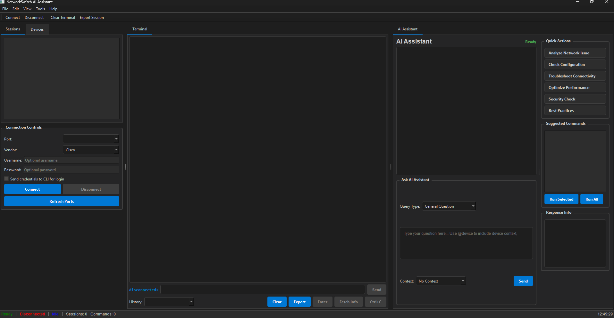
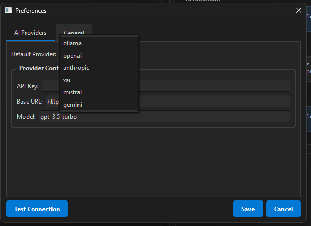

# NetworkSwitch AI Assistant  
### *Your Multi-Vendor Network Brain — Powered by AI*

## Banner


[](https://github.com/a77lic7ion/netx10)
[](https://python.org)
[](LICENSE)

> **One terminal. All vendors. AI-powered.**  
> **Cisco • H3C • Juniper • Huawei** — *Unified, automated, intelligent.*


## Why NetworkSwitch AI?

> **"I wish I had a senior network engineer in my pocket."**  
> Now you do.

- **No more CLI syntax chaos** across vendors  
- **Ask in English** → Get perfect CLI  
- **Translate configs** between Cisco ↔ Huawei ↔ Juniper  
- **Automate faster**, debug smarter, deploy confidently

---

## Screenshots

<div align="center">
  <table>
    <tr>
      <td align="center"><b>Live CLI Terminal</b></td>
      <td align="center"><b>AI Chat Assistant</b></td>
      <td align="center"><b>Multi AI Agents</b></td>
    </tr>
    <tr>
      <td></td>
      <td></td>
      <td></td>
    </tr>
  </table>
</div>

---

## Features

| Feature | Description |
|-------|-----------|
| **Multi-Vendor CLI** | Full support: **Cisco IOS, H3C Comware, Juniper JunOS, Huawei VRP** |
| **Live Serial Terminal** | Syntax highlighting, autocomplete, command history |
| **AI Copilot** | Natural language → **vendor-specific CLI** in seconds |
| **Command Translation** | `show run` → `display current-configuration` — instantly |
| **Config Templates** | Pre-built for VLANs, ACLs, QoS, OSPF, BGP, etc. |
| **Multi-Session Tabs** | Manage 50+ devices with color-coded sessions |

## Workflow


---

## Tech Stack

```yaml
Language:     Python 3.9+
GUI:          PySide6 (Qt6)
Automation:   Netmiko 4.1.2+
AI:           LangChain 0.1.0+
Serial:       PySerial 3.5+
Config:       Pydantic 2.0+
Async:        Asyncio + QAsync
Storage:      SQLite (local)


Getting Started
Prerequisites

Python 3.9+
pip

Install & Run

# Clone the repo
git clone https://github.com/a77lic7ion/netx10.git
cd NetworkSwitch-AI-Assistant

# Install dependencies
pip install -r requirements.txt

# Launch
python src/main.py

Pro tip: Use a virtual environment

python -m venv .venv && source .venv/bin/activate  # Linux/Mac
.venv\Scripts\activate                            # Windows


Phase,Timeline,Features
1. Core,Weeks 1–4,"Vendor detection, session engine"
2. Full Support,Weeks 5–8,100% CLI parity across 4 vendors
3. AI Magic,Weeks 9–12,"Translation, diff, migration"
4. Enterprise,Weeks 13–16,"Bulk ops, audit, analytics"
5. Release,Weeks 17–20,".exe, auto-update, docs"

License


Built for network engineers who want to work smarter, not harder.
⭐ Star this repo if you're ready to ditch CLI chaos!
Star on GitHub: https://github.com/a77lic7ion/netx10